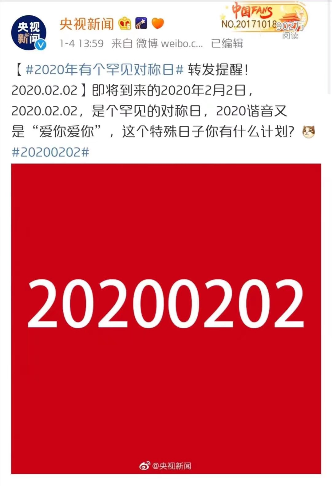
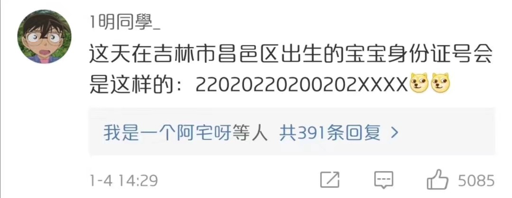

# ID-consist-of-0-and-2

是否存在一个仅由0和2构成的中国居民身份证号?

Is there a Chinese resident ID number consisting only of 0 and 2?

## 项目简介

近日，央视新闻发布了一条微博称2020年02月02日是一个回文数的日期，因为2在互联网文化中有着非常丰富而广泛的含义，这个数字又是日期中非常难以等到的一个回文数，因此带有一定纪念意义。



而网友则在评论区发挥创意构造了一个具有更多2和0的身份证号。



```
这天在吉林市昌邑区出生的宝宝的身份证号会是这样的：22020220200202XXXX🐶🐶
```

鼠宝宝突发奇想，有没有一个只包含2和0的身份证号。（那可就太有意义了太幸运了）

因此写了这样一段代码和创建这个仓库与大家分享

## 代码构成

因为中国居民身份证号码第18位是一个校验位，因此需要有一个函数来负责校验

为了节省时间（其实这么简单一函数也用不了多久，就是懒），这个函数直接用了现有的函数 

[Im670/idcode_check](http://github.com/Im670/idcode_check)

因为该仓库和本项目语言一致均为C语言并且功能简单，故采用

本项目为了节省时间和问题限定，进行了一些降低鲁棒性与复用性的操作，还请谅解。

## 结果解释

计算得到存在以下两个身份证号是合法的。

**220202202002020022**

**220202202002022220**

按照我国国家标准**GB11643-1999《公民身份号码》**中的规定

```
4．顺序码
　　表示在同一地址码所标识的区域范围内，对同年、同月、同日出生的人编定的顺序号，顺序码的奇数分配给男性，偶数分配给女性。
```

从其17位的奇偶性来看，都应该对应女孩子

（女孩纸最棒了！！禁止反驳！！！）

至于其是否会被分配给具体的新生儿，则应看届时办理登记当日的派出所情况以及同日出生情况了。

## 免责声明

本仓库仅对号码生成的技术细节进行讨论，不应涉及任何人口管理的具体行政问题。

本实验在2020年02月02日前进行。

